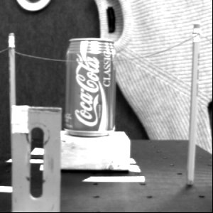

# Optical Flow

The python scripts we should work on are in the folder `data/python`.

The scripts are:
- `horn.py`: this script contains all the functions we need to compute the optical flow using Horn-Schunck method.
- `lucas.py`: this script contains all the functions we need to compute the optical flow using Lucas-Kanade method.

We have been working at the moment with `data/nasa` folder.

 | 
:---:|:---:
*Image used for flow computation* | *Image used for flow computation*

    
    
<em>Optical Flow computed with Horn method</em>

# TODO

- [ ] Take a look at `middlebury.py` and understand which functions we have to use (Visualization, reading GT, etc.)
- [ ] Implement the Lucas-Kanade method correctly
- [ ] Implement reading GT function in both horn and lucas (I've translated the matlab code to python)
- [ ] Compare the results of the two methods with the GT to find the best Hyperparameters
